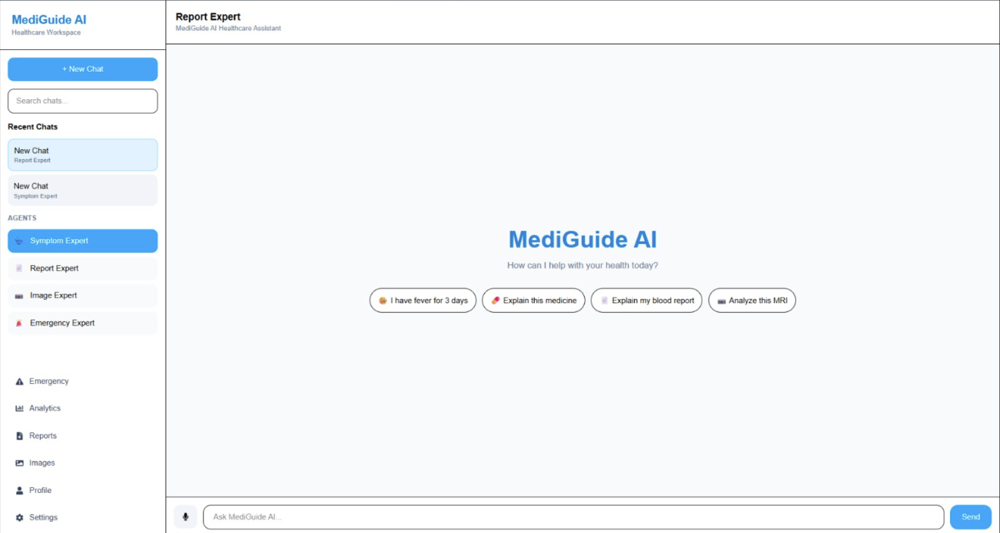

# MediGuide AI



https://mediguide-ai-rho.vercel.app/

MediGuide AI is an AI-powered healthcare assistant designed to provide medical guidance, health insights, report analysis, and emergency support through an intuitive and responsive web application.

## Features

* 🤖 AI-Powered Medical Chat Assistant
* 📄 Medical Report Analysis
* 🖼️ Health Image Analysis
* 🚨 Emergency Guidance & Alerts
* 📊 Health Analytics Dashboard
* 🎤 Voice Interaction Support
* 🔒 Privacy & Consent Management
* ⚠️ Medical Safety Disclaimers
* 📱 Responsive User Interface

## Tech Stack

### Frontend

* React 19
* Vite
* Tailwind CSS
* React Router DOM
* Zustand
* Recharts

### Backend

* FastAPI
* Python
* Uvicorn

### AI & ML

* Google Gemini AI
* TensorFlow
* Scikit-Learn
* NLTK

### Utilities

* Axios
* React Markdown
* PyMuPDF
* ReportLab

## Project Structure

```bash
AI BOT/
├── Backend/
│   ├── app/
│   ├── uploads/
│   ├── main.py
│   └── requirements.txt
│
└── Frontend/
    └── mediguide-ai/
        ├── src/
        ├── public/
        ├── package.json
        └── vite.config.js
```

## Installation

### Frontend

```bash
cd Frontend/mediguide-ai
npm install
npm run dev
```

### Backend

```bash
cd Backend

python -m venv venv

# Windows
venv\Scripts\activate

pip install -r requirements.txt

python -m uvicorn main:app --reload
```

## Environment Variables

Create a `.env` file in the Backend directory:

```env
GEMINI_API_KEY=your_gemini_api_key
```

## Running the Application

Frontend:

```bash
npm run dev
```

Backend:

```bash
python -m uvicorn main:app --reload
```

Frontend URL:

```text
http://localhost:5173
```

Backend URL:

```text
http://127.0.0.1:8000
```

## Compliance & Safety Features

* Medical Disclaimer System
* Emergency Risk Detection
* Privacy Notice & Consent Collection
* Upload Consent Gate
* Safety Badges & Warnings
* AI System Transparency Documentation

## Disclaimer

MediGuide AI is intended for educational and informational purposes only. It does not provide medical diagnosis, treatment, or professional healthcare advice. Always consult qualified healthcare professionals for medical concerns.

## License

This project is developed for educational, research, and healthcare innovation purposes.
